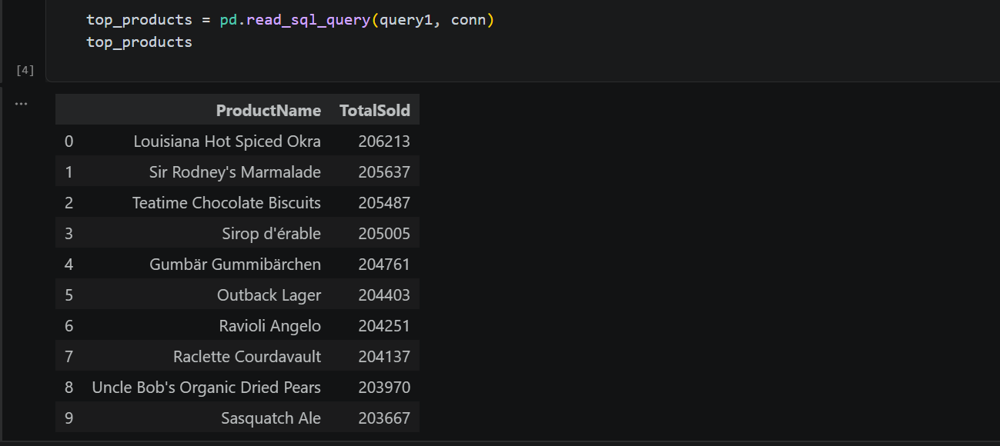
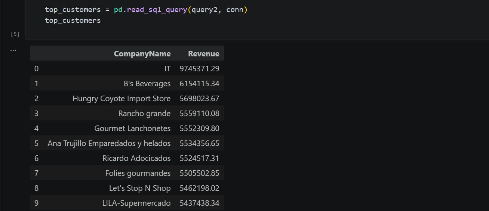
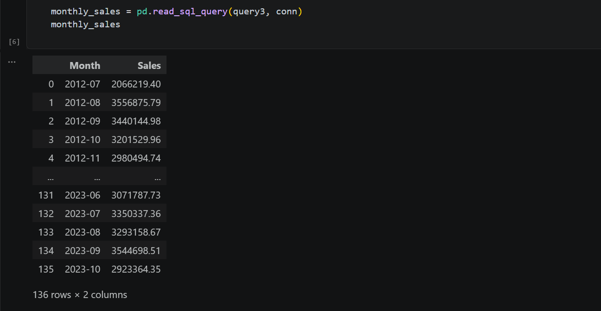
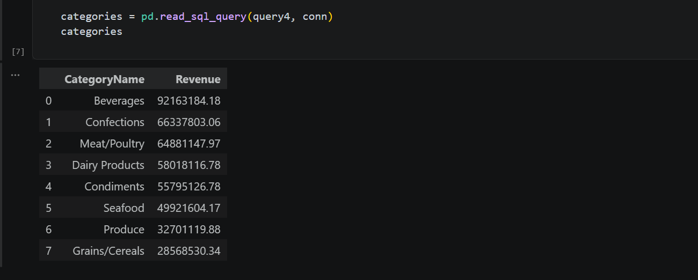
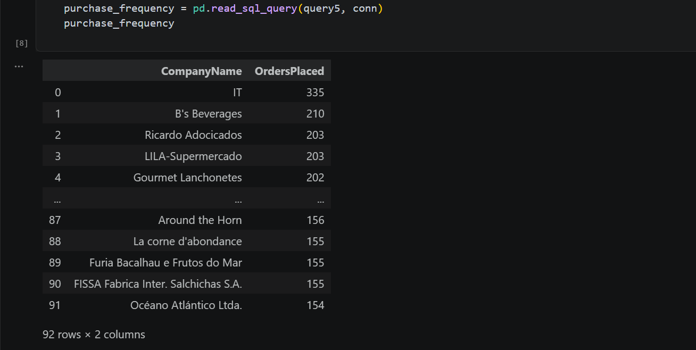

# Northwind Database SQL Analysis

## 📌 Project Overview

This project analyzes the **Northwind SQLite Database** using SQL and Pandas to answer key business questions and generate actionable business insights.

---

## 🗄️ Database Overview

The Northwind database is a sample business database containing information about:

- Customers
- Orders
- Products
- Categories
- Suppliers
- Employees
- Shippers

It is widely used for learning SQL and business data analysis.

---

## 🎯 Business Questions

This project answers the following business questions:

1. What are the top 10 selling products?
2. Who are the top 10 customers by revenue?
3. How do monthly sales change over time?
4. Which product categories perform the best?
5. How frequently do customers place orders?

---

## 📊 Analysis Performed

Using SQL and Pandas, the following analyses were completed:

- Top 10 Selling Products
- Top 10 Customers by Revenue
- Monthly Sales Trends
- Best Performing Product Categories
- Customer Purchase Frequency
- Basic Exploratory Data Analysis
- Data Visualization

---

## 💡 Key Business Insights

1. A small number of products contribute significantly to total sales.
2. Top customers generate a large share of the overall revenue.
3. Monthly sales show noticeable fluctuations over time.
4. Certain product categories consistently outperform others in revenue.
5. Customer purchase frequency varies, highlighting opportunities for customer retention strategies.

---

## 🛠️ Technologies Used

- SQL (SQLite)
- Python
- Pandas
- Matplotlib
- Jupyter Notebook

---

## 📁 Repository Structure

```text
epochs26-day02-sql-analysis/
│
├── analysis.ipynb
├── queries.sql
├── README.md
└── northwind.db
```

---

## 📌 Conclusion

This project demonstrates how SQL and Pandas can be combined to answer business questions, analyze sales performance, and derive meaningful insights from a relational database.


...
## 📌 Conclusion

This project demonstrates how SQL and Pandas can be combined to answer business questions, analyze sales performance, and derive meaningful insights from a relational database.

---

## 📸 SQL Query Outputs

### Query 1: Top 10 Selling Products



---

### Query 2: Top 10 Customers by Revenue



---

### Query 3: Monthly Sales Trends



---

### Query 4: Best Performing Product Categories



---

### Query 5: Customer Purchase Frequency


